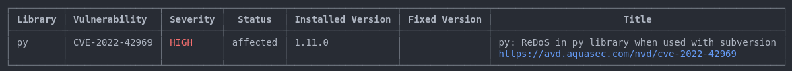
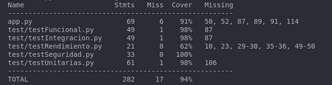

# Testing

## Instrucciones de ejecución
1. Ejecutar el comando `make run-app`
2. Abrimos otra terminal para realizar las pruebas de testing.
3. Ejecutar el comando `make test`
4. Ejecutar el comando `make pylint`
5. Ejecutar el comando `make coverage` para la cobertura
6. Ejecutar el comando `make trivy` para el analisis de seguridad
7. Ejecutar el comando `make clean` para limpiar el entorno de trabajo.

## Reporte de seguridad de Trivy
El reporte de seguridad nos muestra un fallo de intregridad para la versión de python `3.12.4` en Ubuntu. 

[Link al reporte de trivy](https://avd.aquasec.com/nvd/cve-2022-42969)

## Reporte de cobertura
Nos muestra que la calidad del codigo de media en todo el proyecto es del 94% de cobertura.

## Comparativa Poetry vs Projen

| **Característica**              | **Poetry**                                                                                          | **Projen**                                                                                            |
|----------------------------------|-----------------------------------------------------------------------------------------------------|------------------------------------------------------------------------------------------------------|
| **Tipo de archivo de configuración** | Utiliza un archivo declarativo llamado `pyproject.toml`, que es un archivo de texto plano.         | Utiliza un archivo programático `.projenrc.py`, que es un script de Python.                        |
| **Archivo de bloqueo**           | Genera un archivo de bloqueo llamado `poetry.lock` que mantiene versiones exactas de las dependencias. | Crea archivos de dependencias típicos de Python (como `requirements.txt` y `requirements-dev.txt`) junto con una carpeta `.projen` que contiene configuraciones en JSON. |
| **Comando de creación de proyecto**| Para crear un nuevo proyecto, simplemente se necesita crear el archivo `pyproject.toml`.              | Se necesita ejecutar `npx projen new project` para crear un nuevo proyecto, lo que requiere instalar Projen globalmente. |
| **Instalación de Projen**        | Se instala como una dependencia de Python utilizando `pip`.                                         | Requiere instalación global con `npm` usando el comando `npm install -g projen`.                    |
| **Ejecución para instalar dependencias**| Las dependencias se instalan usando `poetry install`.                                               | Se ejecuta con `npx projen` para instalar las dependencias y configurar el proyecto.                |
| **Manejo de dependencias**       | Permite la gestión de dependencias de manera fácil y elegante, con soporte para versiones semánticas. | Projen permite configuraciones más complejas y personalizadas al ser un script, pero puede ser menos intuitivo para usuarios nuevos. |
| **Foco de uso**                  | Especialmente diseñado para el manejo de proyectos Python, enfocado en la simplicidad y el aislamiento de entornos. | Orientado a la automatización de la configuración de proyectos, permitiendo integraciones más complejas. |
| **Configuración de entornos**    | Permite crear y gestionar entornos virtuales de manera automática.                                   | No gestiona entornos virtuales por sí mismo; se puede usar junto con herramientas como `virtualenv` o `venv`. |

## Referencias
- https://earthly.dev/blog/python-makefile/
- https://stackoverflow.com/questions/40720369/how-to-use-wait-in-makefile-when-i-use-it-through-nmake-in-windows
- [Ver prompts](prompt.md)